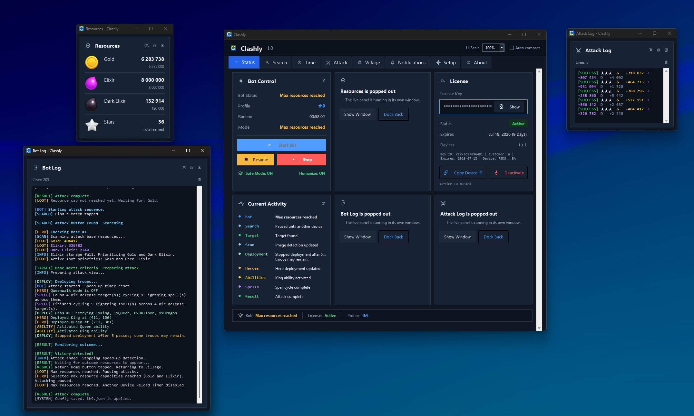
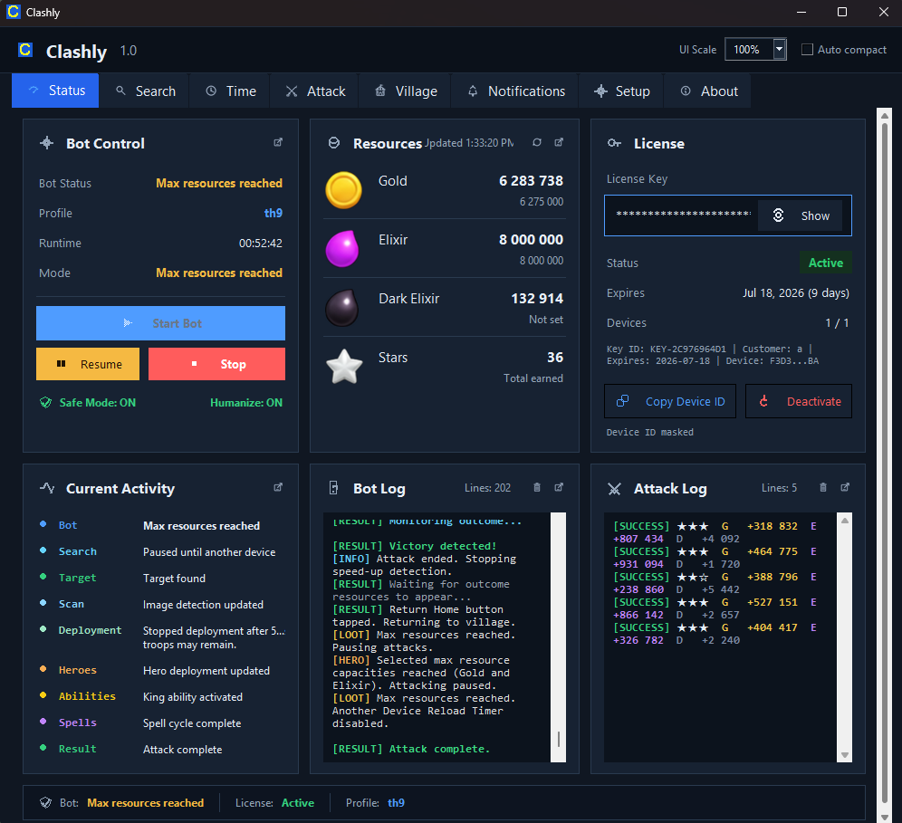
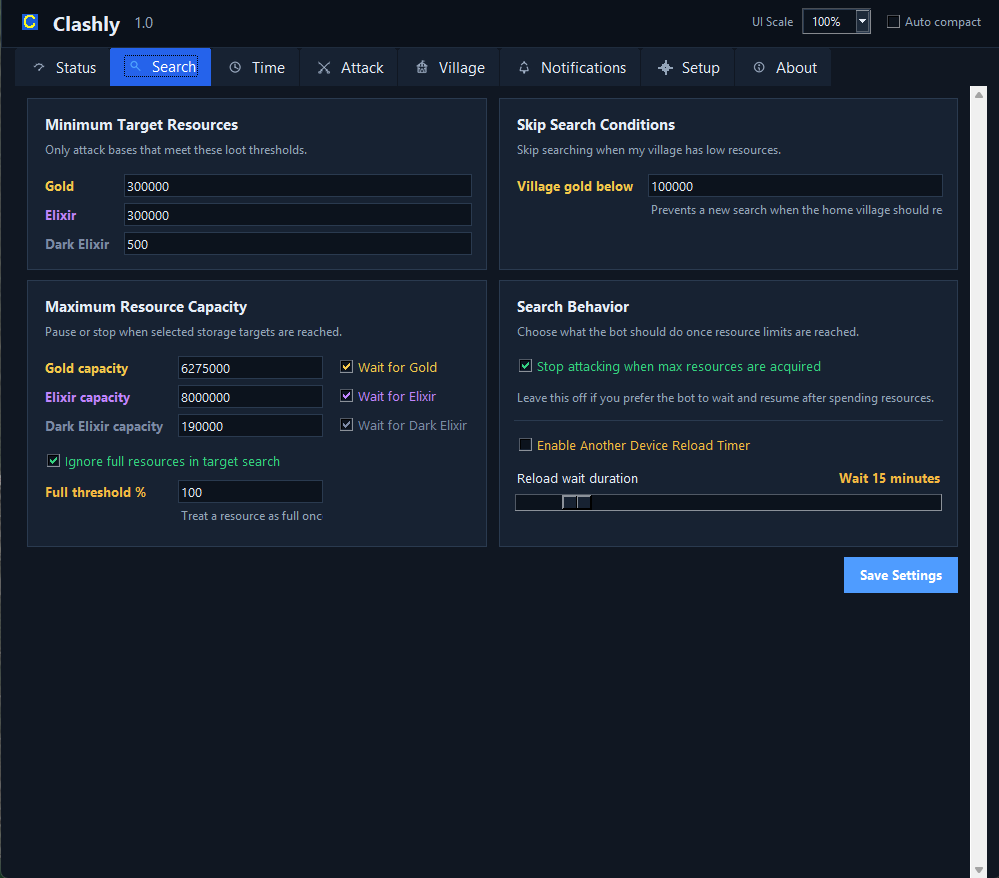
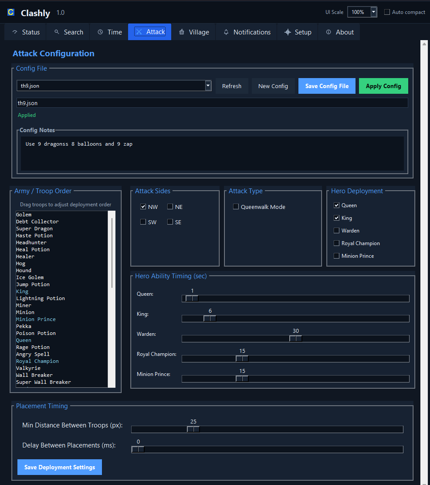
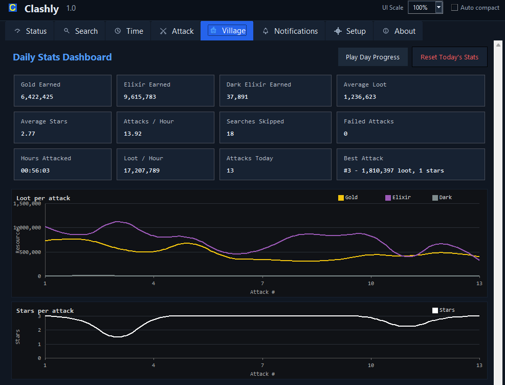
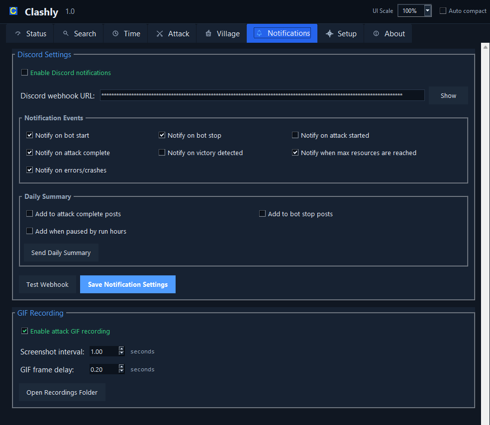

  

# Clashly

Clashly is a Windows desktop control panel for running and monitoring Clash of Clans farming sessions in BlueStacks. It brings target search rules, attack setup, scheduling, loot tracking, live logs, daily stats, setup checks, and Discord notifications into one Tkinter app.

  

## What Clashly Does

- Starts, pauses, resumes, and stops farming sessions from a live status dashboard.
- Searches for bases using Gold, Elixir, and Dark Elixir thresholds.
- Pauses or stops when your village reaches configured storage limits.
- Runs configurable attack profiles with selected sides, troop order, heroes, spells, siege machines, and placement timing.
- Tracks resources, stars, attacks, loot per hour, daily progress, session activity, and attack history.
- Records bot events through live activity, bot log, and attack log panels.
- Sends optional Discord webhook notifications for starts, stops, attacks, results, errors, resource caps, and daily summaries.
- Includes BlueStacks readiness checks for ADB, resolution, and game setup.
- Keeps license details, Discord webhooks, private settings, and local profiles on your own computer.

## Dashboard

The Status tab is the main command center. It shows bot controls, current resource totals, license state, activity stages, bot logs, and attack results while a session is running.

  

Panels can be docked in the main window or popped out into their own windows, which makes it easier to keep resources, logs, and attack history visible while tuning a session.

## Search Rules

The Search tab controls which bases are worth attacking and when Clashly should stop searching. You can set minimum target loot, storage capacity limits, full-resource behavior, and reload wait behavior.

  

## Attack Profiles

The Attack tab manages shareable attack configs. Each profile can include notes, troop deployment order, selected attack sides, hero deployment choices, ability timing, Queenwalk mode, and placement delays.

  

## Stats And Logs

The Village tab turns each run into readable progress: earned loot, average stars, attacks per hour, loot per hour, skipped searches, failed attacks, best attack, and charted attack history.

  

## Discord Notifications

Discord integration is optional. Clashly can post bot lifecycle updates, attack summaries, resource-cap alerts, errors, and daily summaries to a webhook you control. Attack GIF recording can also be enabled from the Notifications tab.

  

## Requirements

- Windows
- BlueStacks with Clash of Clans installed
- BlueStacks configured to Clashly's supported resolution: `860x720`
- A working ADB connection to the BlueStacks instance

## Privacy

Clashly stores private app data locally. License keys, Discord webhook URLs, device details, and local runtime settings are not part of the shareable attack config files by default.

## Disclaimer

Clashly is an independent automation tool and is not affiliated with, endorsed by, sponsored by, or approved by Supercell.
