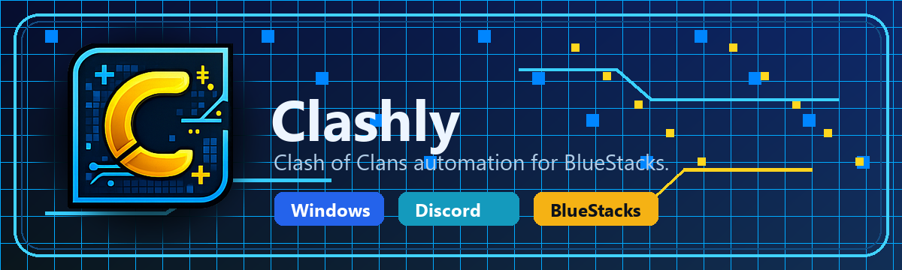

<p align="center">
  
</p>

# Clashly

Clashly is a Windows desktop automation app for Clash of Clans running in BlueStacks. It helps manage scheduled farming sessions, loot tracking, configurable attack settings, visual debugging, and Discord notifications from one Tkinter interface.

## What It Does

- Runs scheduled farming sessions through BlueStacks with Start, Pause, Resume, and Stop controls.
- Searches for targets using configured Gold, Elixir, and Dark Elixir requirements.
- Uses selected attack sides, troops, spells, heroes, siege machines, and timing settings.
- Tracks loot, stars, attacks, daily progress, and session activity in the Status and Village tabs.
- Supports Discord webhook notifications for bot events and attack summaries.
- Includes a BlueStacks setup checklist for ADB, resolution, and game readiness.
- Keeps private settings, license details, webhooks, and local profiles on the user's computer.

## Runtime Notes

Clashly is built for Windows and expects BlueStacks to be configured for the app's supported resolution of `860x720`. The customer-facing build is distributed through the installer created at:

```text
installer\ClashlySetup.exe
```

The installer bundles the application executable, Android platform-tools, image templates, and default shareable attack/search configs.

## Disclaimer

Clashly is an independent automation tool and is not affiliated with, endorsed by, sponsored by, or approved by Supercell.
